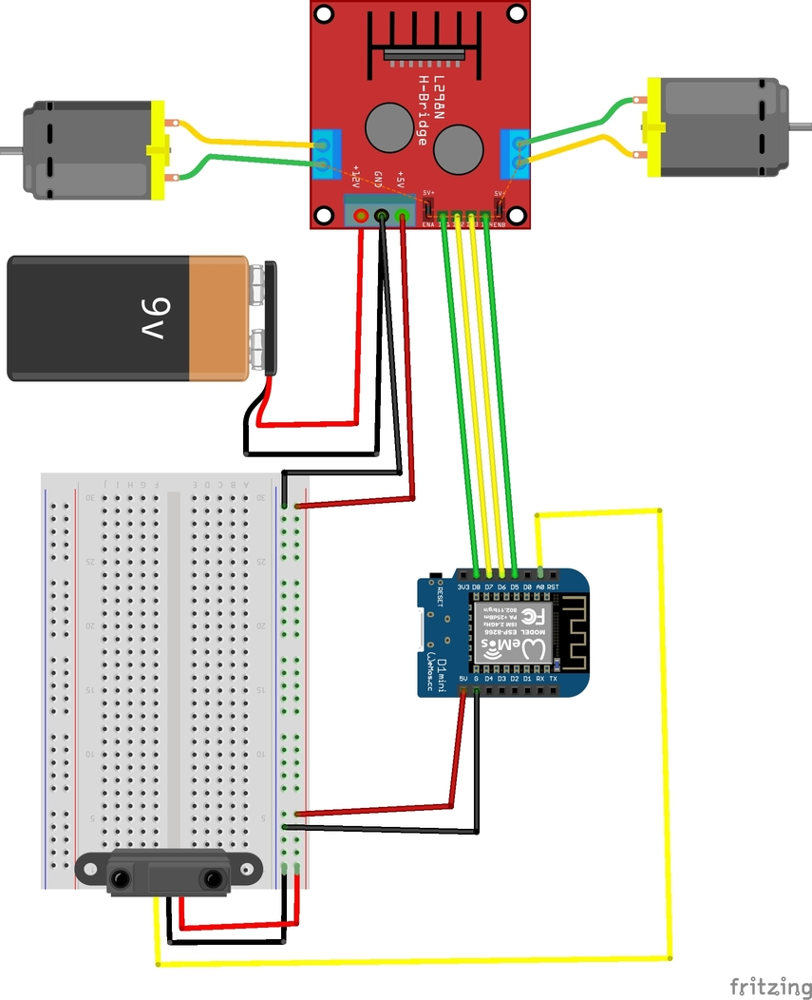

## ArduCar

I create this project during my academic thesis.
The subject of the project is "Construction of educational automation with the possibility of programming through a graphical interface".
I was asked to use Firmata as communication protocol and Blockly as graphical interface.

Components used in this project: 
- 1 breadboard
- 1 battery 9V
- 1 Wemos D1 mini
- 1 L298N motor driver
- 2 DC motors
- 1 Sharp IR Sensor (GP2Y0A41SK0F)

Firmata interacting with microcontrollers:
- https://github.com/firmata/arduino

I decided to use the johhny-five library to connect firmata with my microcontroller: 
- https://github.com/rwaldron/johnny-five
- http://johnny-five.io/
